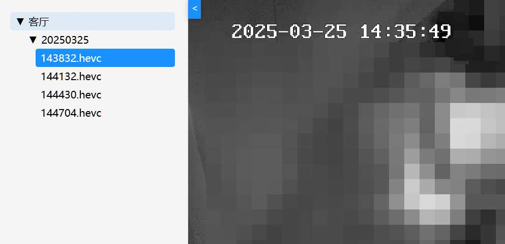

# 联通监控数据抓取

## 源码说明

- [py 源码](back)是妖友的（妖火论坛用户）
- **使用本程序时，应当尊重开源协议，保留作者信息**
- 联通看家：https://we.wo.cn/web/smart-club-pc-v2/?clientId=1001000001

## 开发计划

- [x] 摄像头录像
- [x] 支持多个摄像头和断开重连
- [x] 支持自定义视频存储路径
- [x] 支持设置摄像头视频保留天数
- [x] 支持网页在线查看视频文件
- [x] 自动发现设备（填入 token 即可）
- [] RTSP 转发模式

## 使用说明

1. 从 [Releases](https://github.com/zgcwkjOpenProject/GO_UnicomMonitor/releases) 下载 **二进制程序** 和 **config.json** 文件
2. 修改配置文件 **config.json**，填入 `token` 和 `mobile`
3. 启动程序（首次自动发现设备，生成 `video.json`）

### 配置文件

**config.json**（程序只读）

```
host    -> 监听地址
user    -> 身份验证（用户名:密码）
path    -> 存储位置
sleep   -> 重连间隔（秒）
mobile  -> 手机号
token   -> 联通 token（token_online）
mode    -> 运行模式：record(录制) / forward(RTSP转发)
```

**video.json**（自动生成，也可手动编辑）

```
name        -> 设备名称
size        -> 截断大小（MB）
count       -> 保留天数
wsHost      -> WebSocket 地址
deviceId    -> 设备 ID
channelNo   -> 通道号
token       -> 视频云 token
relayServer -> 中继服务器地址
```

> `paramMsg` 每次连接时自动生成，无需手动配置

## 运行效果


